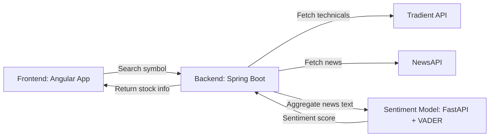

# Winds of Money

**Winds of Money** is a fintech web application that provides **real-time stock insights, fundamental analysis, news aggregation, sentiment scoring, and simple return predictions** for Indian stocks. It’s designed as a hackathon prototype to demonstrate an end-to-end stock analysis pipeline.

---

## Features

- Search any Indian stock by its symbol (e.g., `TCS`, `RELIANCE`)  
- Fetch **current price** and **technical fundamentals**:
  - Relative Strength Index (RSI)  
  - Exponential Moving Average (EMA20)  
  - MACD Indicator  
  - Market Recommendation  
- Aggregate **recent news** for the stock (via NewsAPI)  
- Perform **sentiment analysis** on news headlines (via Python/VADER model)  
- Predict **1-month return** using a simple heuristic combining price, sentiment, and momentum  
- Color-coded **Bullish/Bearish/Neutral outlook** for easy visualization  

---

## Tech Stack

| Layer             | Technology                  |
|------------------|-----------------------------|
| Frontend          | Angular 18, TypeScript      |
| Backend           | Spring Boot, Java           |
| Stock Data API    | [Tradient API](https://www.tradient.com/) |
| News API          | [NewsAPI.org](https://newsapi.org/) |
| Sentiment Model   | Python, FastAPI, VADER      |
| Styling & Animations | CSS, Tailwind (optional), Custom Loader Animations |

---

## Architecture & Flow



## Set Up

### Frontend (Angular)
- User searches for a stock symbol.
- Displays stock fundamentals, sentiment, predicted return, and recent news.
- Includes interactive loader animation and bullish/bearish animations.

### Backend (Spring Boot)
- Fetches stock technical data from Tradient API.
- Fetches recent news from NewsAPI.
- Aggregates news and calls sentiment service.
- Calculates simple 1-month return prediction and outlook.

### Sentiment Model (Python FastAPI)
- Receives aggregated news text via POST request.
- Uses VADER Sentiment Analyzer to compute a sentiment score (-1 to 1).
- Returns sentiment score to backend.

---

## Setup Instructions

### Backend (Spring Boot)
1. Clone the repository:
    ```bash
    git clone <repo-url>
    cd winds-of-money/Backend
    ```
2. Create a `.env` or `application.properties` file with:
    ```properties
    news.api.key=<YOUR_NEWSAPI_KEY>
    sentiment.service.url=http://localhost:8000/analyze
    ```
3. Run the backend:
    ```bash
    mvn clean spring-boot:run
    ```
- Backend runs on [http://localhost:8080](http://localhost:8080).

### Sentiment Service (Python)
1. Navigate to the model folder:
    ```bash
    cd model
    ```
2. Install dependencies:
    ```bash
    pip install -r requirements.txt
    ```
3. Run the FastAPI service:
    ```bash
    uvicorn model_api:app --reload --host 0.0.0.0 --port 5000
    ```
- Sentiment service runs on [http://localhost:5000](http://localhost:5000).

### Frontend (Angular)
1. Navigate to the frontend folder:
    ```bash
    cd winds-of-money-client
    ```
2. Install dependencies:
    ```bash
    npm install
    ```
3. Run Angular dev server:
    ```bash
    ng serve
    ```
- Angular runs on [http://localhost:4200](http://localhost:4200).

---

## Example Usage
- Search for `TCS`
    - Current price: 2998.7
    - RSI: 48.27 - Neutral momentum
    - MACD: 0.17 - Bullish trend
    - Market Recommendation: Neutral
    - Predicted 1M Return: 0.7%
- News headlines with links and sentiment score displayed.

---

## Screenshots / Prototype

### Screenshots


### Demo Video

https://github.com/user-attachments/assets/5c813e91-7857-4184-b9cb-a3106a57e5ae


---

## Notes
- Prediction logic is proof-of-concept and rule-based, **not financial advice**.
- All APIs used are free-tier (or require free signup).
- Designed for hackathon demo with smooth frontend animations.

---

## Future Improvements
- Integrate historical data for better return prediction.
- Add interactive charts for stock trends.
- Improve sentiment model using LLM or deep learning.
- Add options / derivatives predictions.

---


**Notes:**  
- Angular frontend runs on [http://localhost:4200](http://localhost:4200).  
- Backend Spring Boot server runs on [http://localhost:8080](http://localhost:8080).  
- Sentiment service runs on [http://localhost:5000](http://localhost:5000).  
